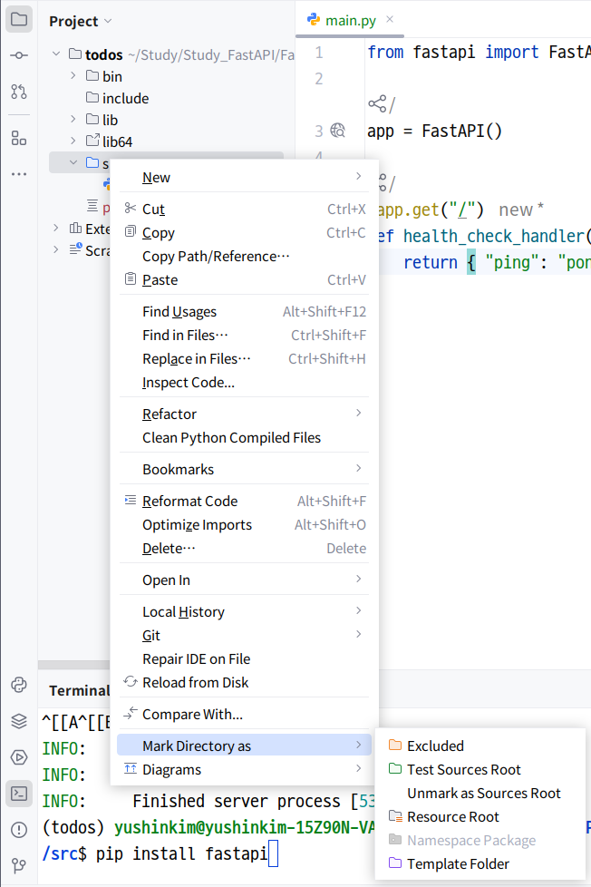
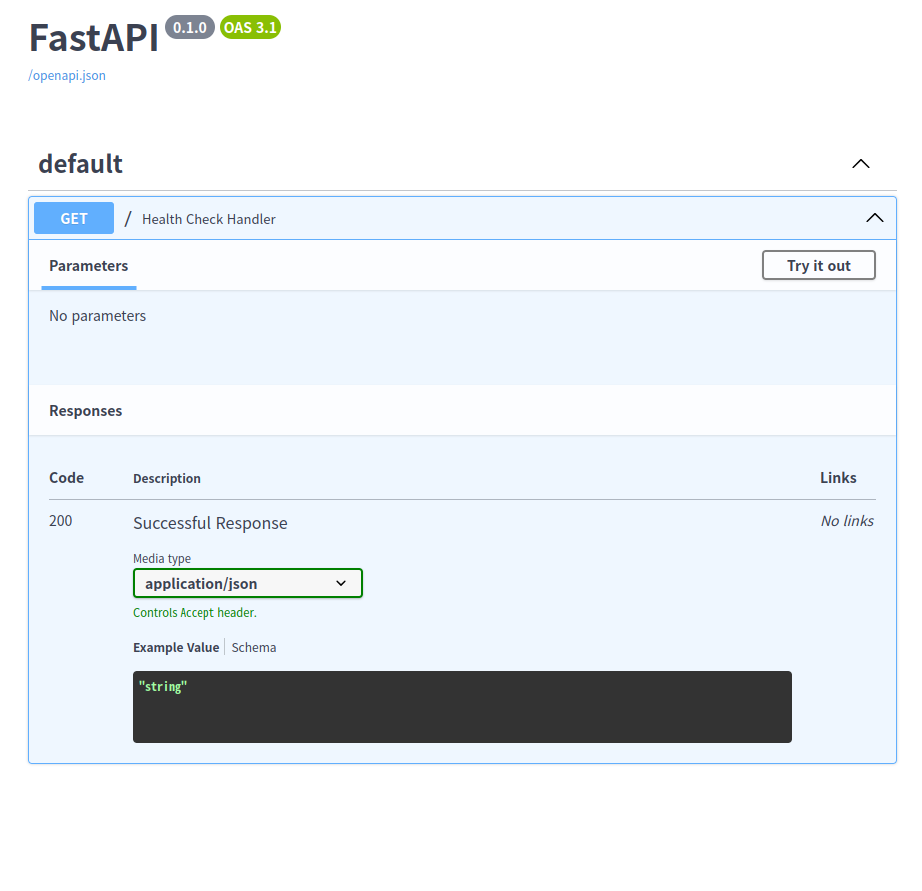

# Section 02. FastAPI 알아보기

## 기본 설정

Ubuntu desktop OS, PyCharm을 사용해 실습을 진행한다. 먼저 프로젝트를 생성하고 FastAPI를 사용하기 위해 필요한 패키지들을 설치한다.

```
$ sudo apt-get update -y
$ sudo apt-get upgrade -y
$ sudo apt-get install python3.10 python3.10-venv python3.10-dev
$ pip install fastapi
$ pip install uvicorn
```

그 다음 `python3.10 -m venv [Project name]` 명령어로 가상환경을 생성하고, 해당 디렉터리로 이동해 `source bin/activate`로 가상환경을 활성화한다.

마지막으로 Pycharm에서 해당 디렉터리를 기준으로 프로젝트를 열고 하위 디렉터리로 **src**를 생성한 후 **Mark Directory as > Sources Root**로 소스 디렉터리로 지정한다.



## 헬스체크 API 작성

이제 FastAPI를 사용해 첫 번째 API를 작성해 보자.

**src/main.py**

```
from fastapi import FastAPI

app = FastAPI()

@app.get("/")
def health_check_handler():
    return { "ping": "pong" }
```

서버 배포 시 서버가 살아있는지 확인하기 위한 헬스체크 API를 만들었다. 다른 백엔드 프레임워크들과 비슷하게 데코레이터로 API 경로를 명시하고 핸들러 함수를 정의한다.

이제 터미널에서 **src** 디렉터리로 이동해 `uvicorn main:app`으로 애플리케이션을 실행하면 기본적으로 8000번 포트에서 서버가 실행된다.

```
src$ uvicorn main:app
INFO:     Started server process [579543]
INFO:     Waiting for application startup.
INFO:     Application startup complete.
INFO:     Uvicorn running on http://127.0.0.1:8000 (Press CTRL+C to quit)
```

해당 경로로 접속하면 헬스체크 핸들러의 JSON 형식 응답을 확인할 수 있고, **origin/docs** 경로로 이동하면 자동 생성된 API 문서를 확인할 수 있다.



## GET API 작성과 요청 파라미터

API를 구성할 때 가장 기본적인 기능은 특정 모듈의 데이터를 조회하는 것이다. 이를 FastAPI로 구현해 보자.

**src/main.py**

```
todo_data = {
    1: {
        "id": 1,
        "content": "투두 리스트 내용 1",
        "is_done": True,
    },
    2: {
        "id": 2,
        "content": "투두 리스트 내용 2",
        "is_done": False,
    },
    3: {
        "id": 3,
        "content": "투두 리스트 내용 3",
        "is_done": False,
    },
}

@app.get("/todos")
def get_todos_handler(order: str | None = None):
    ret = list(todo_data.values())
    if order and order == "DESC":
        return ret[::-1]
    else:
        return ret
```

메모리 기반으로 작성하였고, 쿼리 파라미터를 지정하는 부분이 특이하다. FastAPI에서는 쿼리 파라미터를 핸들러 함수의 매개변수에서 다룰 수 있다.

그리고 파이썬도 타입스크립트와 비슷하게 타이핑이 가능한데, `str | None = None`은 문자열이거나 값이 없어도 된다는 것이고 기본값은 값이 없는 것이라는 의미이다.

다음으로는 특정 데이터를 가져오는 API를 작성해 보자.

**src/main.py**

```
@app.get("/todos/{todo_id}")
def get_todo_handler(todo_id: int):
    return todo_data.get(todo_id, {})
```

URI 파라미터의 경우 경로에 `{[parameter name]}`와 같이 명시하고 핸들러 함수의 매개변수로 같은 이름의 변수를 정의함으로써 사용할 수 있다.

## POST API 작성과 Request Body 모델

이번에는 FastAPI로 모듈 데이터를 생성하는 API를 작성해 보자.

**src/main.py**

```
from pydantic import BaseModel
...
class CreateToDoRequest(BaseModel):
    id: int
    content: str
    is_done: bool

@app.post("/todos")
def create_todo_handler(request: CreateToDoRequest):
    todo_data[request.id] = request.model_dump()
    return todo_data[request.id]
```

NestJS에서는 `CreateToDoRequest`와 같이 요청 데이터의 형식을 담는 객체를 DTO라고 부른다. 그러나 FastAPI에서는 이를 Request Body 모델이라고 부르며, pydantic의 `BaseModel`을 상속받아 정의한다.

핸들러 함수의 매개변수 이름은 어떤 것으로 정하든 상관이 없다. 단, 타입을 `CreateToDoRequest`로 명시함으로써 FastAPI가 요청 바디를 추출해야 한다는 단서를 얻게 된다.

## PATCH API 작성과 단일한 바디 데이터 처리

이번에는 FastAPI로 모듈 데이터를 수정하는 API를 작성해 보자.

**src/main.py**

```
@app.patch("/todos/{todo_id}")
def update_todo_handler(
        todo_id: int,
        is_done: bool = Body(..., embed=True),
):
    todo = todo_data.get(todo_id)
    if (todo):
        todo["is_done"] = is_done
        return todo
    return {}
```

이전에 작성한 POST API와의 차이점은 요청 바디를 통해 데이터를 전달받지만 별도의 Request Body 모델을 정의하지 않았다는 것이다.

`Body`는 FastAPI에서 요청 바디를 전달받을 때 사용하는 함수이다. 이 함수의 매개변수 중 `...`은 해당 매개변수가 필수임을 의미하고, `embed=True`는 매개변수의 이름을 키로 가지는 JSON 객체를 전송해야 함을 강제한다.

즉, `embed=True`를 설정하지 않으면 이 API는 요청으로 `true`와 같은 단순한 JSON을 기대한다. 그러나 이를 설정하면 `{ "is_done": true }`와 같은 구조의 요청 바디를 전송해야 한다.

## DELETE API 작성

마지막으로 FastAPI에서 모듈 데이터를 삭제하는 API를 작성해 보자.

**src/main.py**

```
@app.delete("/todos/{todo_id}")
def delete_todo_handler(todo_id: int):
    todo_data.pop(todo_id, None)
    return list(todo_data.values())
```

## HTTP Status Code

이제까지 진행한 실습에서는 상태 코드 처리를 진행하지 않았다. 이제 예외 처리와 함께 예외 상황에 대한 상태 코드를 정리해 보자.

먼저, FastAPI 설계 중 사용될 수 있는 흔한 HTTP 상태 코드들은 다음과 같은 것들이 있다.

|        Status Code        | Meaning                               |
| :-----------------------: | :------------------------------------ |
|          200 OK           | 성공                                  |
|        201 Created        | 생성됨                                |
|      204 No Content       | 성공하였으나 응답할 데이터 없음       |
|      400 Bad Request      | 잘못된 요청                           |
|     401 Unauthorized      | 사용자가 인증되지 않음                |
|       403 Forbidden       | 자원 접근이 허용되지 않음             |
|       404 Not Found       | 자원이 존재하지 않음                  |
|       409 Conflict        | 서버 상태와 충돌함                    |
| 422 Unprocessable Entity  | 요청 형식이 잘못됨                    |
| 500 Internal Server Error | 범용적인 서버 에러                    |
|      502 Bad Gateway      | 리버스 프록시에서 서버 응답 처리 불가 |
|  503 Service Unavailable  | 서버가 요청을 처리할 수 없음          |

**src/main.py**

```
from fastapi import FastAPI, Body, HTTPException
from pydantic import BaseModel

app = FastAPI()

@app.get("/", status_code=200)
def health_check_handler():
    return { "ping": "pong" }

todo_data = {
    1: {
        "id": 1,
        "content": "투두 리스트 내용 1",
        "is_done": True,
    },
    2: {
        "id": 2,
        "content": "투두 리스트 내용 2",
        "is_done": False,
    },
    3: {
        "id": 3,
        "content": "투두 리스트 내용 3",
        "is_done": False,
    },
}

@app.get("/todos", status_code=200)
def get_todos_handler(order: str | None = None):
    ret = list(todo_data.values())
    if order and order == "DESC":
        return ret[::-1]
    else:
        return ret

@app.get("/todos/{todo_id}", status_code=200)
def get_todo_handler(todo_id: int):
    todo = todo_data.get(todo_id)
    if todo:
        return todo
    raise HTTPException(status_code=404, detail="To Do Not Found")

class CreateToDoRequest(BaseModel):
    id: int
    content: str
    is_done: bool

@app.post("/todos", status_code=201)
def create_todo_handler(request: CreateToDoRequest):
    todo_data[request.id] = request.model_dump()
    return todo_data[request.id]

@app.patch("/todos/{todo_id}", status_code=200)
def update_todo_handler(
        todo_id: int,
        is_done: bool = Body(..., embed=True),
):
    todo = todo_data.get(todo_id)
    if (todo):
        todo["is_done"] = is_done
        return todo
    raise HTTPException(status_code=404, detail="To Do Not Found")

@app.delete("/todos/{todo_id}", status_code=204)
def delete_todo_handler(todo_id: int):
    todo = todo_data.pop(todo_id, None)
    if todo:
        return
    raise HTTPException(status_code=404, detail="To Do Not Found")
```

성공 시의 상태 코드는 데코레이터에서 정의할 수 있다. 그러나 예외 상황의 경우 직접 `raise HTTPException()`으로 상태 코드와 상세 정보를 명시해 주어야 한다.
