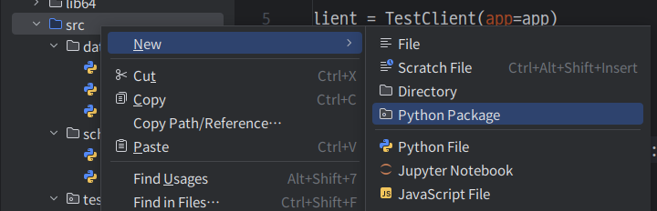

# Section 04. 테스트 코드

## 기본 설정

`PyTest`를 사용해 작성한 API에 대한 테스트 코드들을 작성해 보자. 먼저 필요한 패키지부터 설치한다.

```
$ pip install pytest
$ pip install httpx
```



그 다음에는 **src/tests** 디렉터리를 파이썬 패키지로 생성한다. 이렇게 하면 `PyTest`가 테스트 코드 파일의 경로를 찾을 수 있다.

이제 간단하게 헬스체크 API에 대한 테스트 코드를 작성해 보자.

**src/tests/test_main.py**

```
from fastapi.testclient import TestClient

from main import app

client = TestClient(app=app)

def test_health_check():
    response = client.get("/")
    assert response.status_code == 200
    assert response.json() == { "ping": "pong" }
```

이제 터미널에서 `pytest` 명령어로 테스트를 실행할 수 있다.

```
$ pytest
============================== test session starts ===============================
platform linux -- Python 3.10.12, pytest-8.3.2, pluggy-1.5.0
rootdir: /home/yushinkim/Study/Study_FastAPI/FastAPI_Basic/todos/src
plugins: anyio-4.4.0
collected 1 item

tests/test_main.py .                                                       [100%]

=============================== 1 passed in 0.74s ================================
```

## 테스트 코드 - GET 전체 조회 API

기존에 작성했던 전체 조회 API에 대한 테스트 코드를 작성해 보자.

**src/main.py**

```
@app.get("/todos", status_code=200)
def get_todos_handler(
        order: str | None = None,
        session: Session = Depends(get_db)
) -> ToDoListSchema:
    todos: List[ToDo] = get_todos(session=session)

    if order and order == "DESC":
        return ToDoListSchema(
            todos=[
                ToDoSchema.model_validate(todo)
                for todo in todos[::-1]
            ]
        )
    else:
        return ToDoListSchema(
            todos=[
                ToDoSchema.model_validate(todo)
                for todo in todos
            ]
        )
```

**src/tests/test_main.py**

```
def test_get_todos():
    # order=ASC
    response = client.get("/todos")
    assert response.status_code == 200
    assert response.json() == {
        "todos": [
            {"id": 1, "content": "FastAPI Section 0", "is_done": True},
            {"id": 2, "content": "FastAPI Section 1", "is_done": True},
            {"id": 3, "content": "FastAPI Section 2", "is_done": False},
            {"id": 4, "content": "string", "is_done": False},
        ]
    }

    # order=DESC
    response = client.get("/todos?order=DESC")
    assert response.status_code == 200
    assert response.json() == {
        "todos": [
            {"id": 4, "content": "string", "is_done": False},
            {"id": 3, "content": "FastAPI Section 2", "is_done": False},
            {"id": 2, "content": "FastAPI Section 1", "is_done": True},
            {"id": 1, "content": "FastAPI Section 0", "is_done": True},
        ]
    }
```

이 테스트 코드에는 문제점이 있다. 현재 데이터베이스에 저장된 데이터를 기준으로 응답 데이터를 기대하고 있기 때문에 데이터베이스에 변경이 일어나면 테스트가 실패하게 된다.

## PyTest Mocking

앞서 실제 데이터베이스에 요청을 보내 데이터를 가져오기 때문에 테스트가 데이터베이스 상태에 의존적이게 되는 문제가 있었다.

이것은 통합 테스트에서 조정해야 할 일이고, 지금은 단위 테스트를 작성하고 있는 것이기에 함수 모킹이 필요하다.

모킹을 수행하기 위해 먼저 패키지를 설치하자.

```
$ pip install pytest-mock
```

그 다음 기존의 테스트 코드를 다음과 같이 변경한다.

**src/tests/test_main.py**

```
def test_get_todos(mocker):
    # order=ASC
    mocker.patch("main.get_todos", return_value=[
        ToDo(id=1, content="FastAPI Section 0", is_done=True),
        ToDo(id=2, content="FastAPI Section 1", is_done=False)
    ])
    response = client.get("/todos")
    assert response.status_code == 200
    assert response.json() == {
        "todos": [
            {"id": 1, "content": "FastAPI Section 0", "is_done": True},
            {"id": 2, "content": "FastAPI Section 1", "is_done": False},
        ]
    }

    # order=DESC
    response = client.get("/todos?order=DESC")
    assert response.status_code == 200
    assert response.json() == {
        "todos": [
            {"id": 2, "content": "FastAPI Section 1", "is_done": False},
            {"id": 1, "content": "FastAPI Section 0", "is_done": True},
        ]
    }
```

테스트 함수의 매개변수로 `mocker`를 전달하고 테스트 함수 내부에서 `mocker.patch()`로 모킹할 함수와 모킹할 반환값을 정의하면 된다.

## PyTest Fixture

앞서 작성한 테스트 코드에선 테스트 함수가 정의되어 있는 파일에 `TestClient` 객체가 별도로 정의되어 있었다. 모듈이 많아지면 일일이 클라이언트 객체를 생성하는 작업이 반복된다.

이처럼 반복되는 요소는 PyTest의 `Fixture`로 등록함으로써 손쉽게 불러와 사용할 수 있다.

새로운 파일을 생성하고 클라이언트를 정의한 부분을 다음과 같이 바꾸어 보자.

**src/tests/conftest.py**

```
import pytest

from fastapi.testclient import TestClient
from main import app

@pytest.fixture()
def client():
    return TestClient(app=app)
```

이렇게 픽스쳐로 등록하면 테스트 코드에서는 다음과 같이 사용할 수 있다.

**src/tests/test_main.py**

```
...
def test_health_check(client):
...
def test_get_todos(client, mocker):
...
```

코드를 보면 알 수 있듯이, `mocker`도 픽스쳐의 한 종류이다.

## 테스트 코드 - GET 단일 조회 API

이번에는 단일 조회 API에 대한 테스트 코드를 작성해 보자.

**src/tests/test_main.py**

```
def test_get_todo(client, mocker):
    # 200
    mocker.patch(
        "main.get_todo_by_todo_id",
        return_value=ToDo(id=1, content="todo", is_done=True),
    )

    response = client.get("/todos/1")
    assert response.status_code == 200
    assert response.json() == {
        "id": 1,
        "content": "todo",
        "is_done": True,
    }

    # 404
    mocker.patch("main.get_todo_by_todo_id", return_value=None)

    response = client.get("/todos/1")
    assert response.status_code == 404
    assert response.json() == {"detail": "To Do Not Found"}
```

## 테스트 코드 - POST API

이번에는 POST API에 대한 테스트 코드를 작성해 보자.

**src/tests/test_main.py**

```
def test_create_todo(client, mocker):
    create_spy = mocker.spy(ToDo, "create")

    mocker.patch(
        "main.create_todo",
        return_value=ToDo(id=1, content="todo", is_done=True)
    )

    body = {
        "content": "test",
        "is_done": False,
    }
    response = client.post("/todos", json=body)

    assert create_spy.spy_return.id is None
    assert create_spy.spy_return.content == "test"
    assert create_spy.spy_return.is_done == False

    assert response.status_code == 201
    assert response.json() == {
        "id": 1,
        "content": "todo",
        "is_done": True,
    }
```

이 코드는 모킹의 취약점을 잘 나타내는 코드이다. 비즈니스 로직을 생각해 보면 위와 같이 요청 바디와 응답의 형식이 다른 경우엔 에러가 발생해야 하지만, 반환값을 모킹한 것이기에 응답 형식이 달라도 테스트를 통과하게 된다. 그러므로 모킹을 사용할 땐 이러한 점을 주의해야 한다.

## 테스트 코드 - PATCH API

이번에는 PATCH API에 대한 테스트 코드를 작성해 보자.

**src/tests/test_main.py**

```
def test_update_todo(client, mocker):
    # 200
    mocker.patch(
        "main.get_todo_by_todo_id",
        return_value=ToDo(id=1, content="todo", is_done=True),
    )
    undone = mocker.patch.object(ToDo, "undone")
    mocker.patch(
        "main.update_todo",
        return_value=ToDo(id=1, content="todo", is_done=False),
    )

    response = client.patch("/todos/1", json={"is_done": False})

    undone.assert_called_once_with()
    assert response.status_code == 200
    assert response.json() == {
        "id": 1,
        "content": "todo",
        "is_done": False,
    }

    # 404
    mocker.patch("main.get_todo_by_todo_id", return_value=None)

    response = client.patch("/todos/1", json={"is_done": False})

    assert response.status_code == 404
    assert response.json() == {"detail": "To Do Not Found"}
```

`undone()` 메서드의 호출 여부를 검증하기 위해 `mocker.patch.object()`를 사용했다. 그 외의 로직은 POST API와 유사하다.

## 테스트 코드 - DELETE API

마지막으로 DELETE API에 대한 테스트 코드를 작성해 보자.

**src/tests/test_main.py**

```
def test_delete_todo(client, mocker):
    # 204
    mocker.patch(
        "main.get_todo_by_todo_id",
        return_value=ToDo(id=1, content="todo", is_done=True)
    )
    mocker.patch("main.delete_todo", return_value=None)

    response = client.delete("/todos/1")
    assert response.status_code == 204

    # 404
    mocker.patch("main.get_todo_by_todo_id", return_value=None)

    response = client.delete("/todos/1")
    assert response.status_code == 404
    assert response.json() == {"detail": "To Do Not Found"}
```

이렇게 모든 API에 대한 테스트 코드 작성을 마쳤다.
