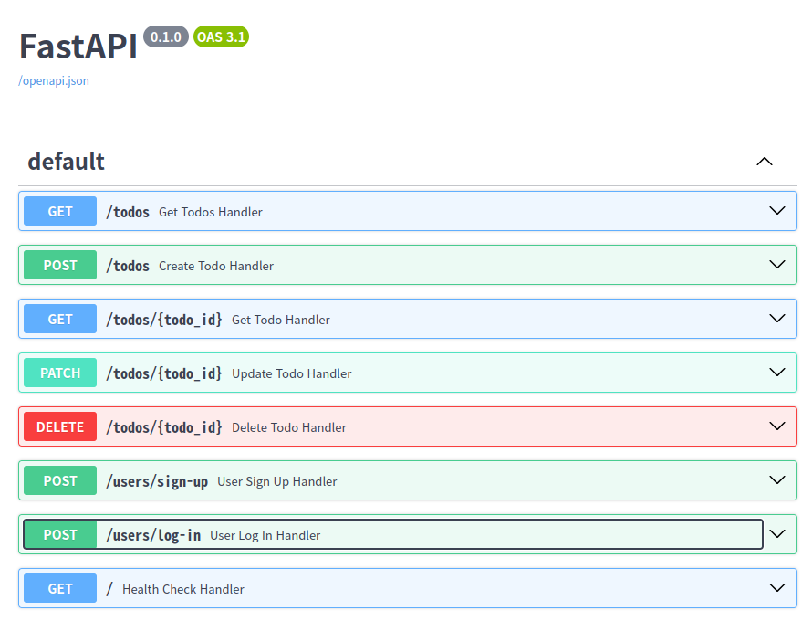
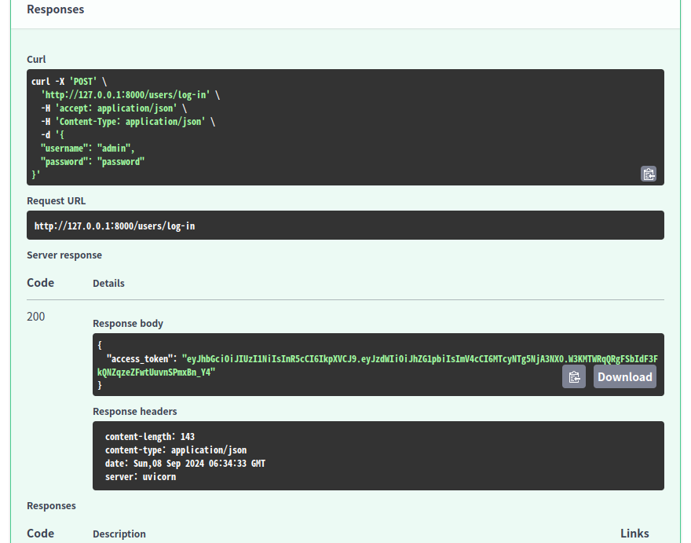
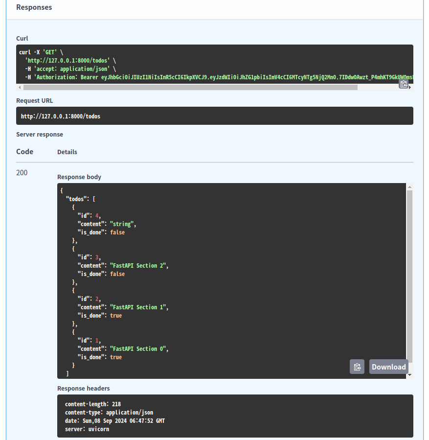

# Section 06. 기능 고도화

## User 모델링

이제 사용자와 todo 간의 관계를 정의하기 위해 `User` ORM을 정의할 것이다.

**src/database/orm.py**

```
from sqlalchemy import Boolean, Column, Integer, String, ForeignKey
from sqlalchemy.orm import declarative_base

from schema.request import CreateToDoRequest

Base = declarative_base()

class ToDo(Base):
    __tablename__ = "todo"  # name of table

    id = Column(Integer, primary_key=True, index=True)
    content = Column(String(256), nullable=False)
    is_done = Column(Boolean, nullable=False)
    user_id = Column(Integer, ForeignKey("user.id"))

    def __repr__(self):
        return f"ToDo(id={self.id}, content={self.content}, is_done={self.is_done}"

    @classmethod
    def create(cls, request: CreateToDoRequest) -> "ToDo":
        return cls(
            content=request.content,
            is_done=request.is_done,
        )

    def done(self) -> "ToDo":
        self.is_done = True
        return self

    def undone(self) -> "ToDo":
        self.is_done = False
        return self

class User(Base):
    __tablename__ = "user"

    id = Column(Integer, primary_key=True, index=True)
    username = Column(String(256), nullable=False)
    password = Column(String(256), nullable=False)
```

이렇게 생성하였다면 다음으로는 기존의 데이터베이스에 테이블을 추가하고 빈 컬럼에 값을 넣어 주어야 한다.

```
CREATE TABLE user (
    id INTEGER NOT NULL AUTO_INCREMENT,
    username VARCHAR(256) NOT NULL,
    password VARCHAR(256) NOT NULL,
    PRIMARY KEY (id)
);
ALTER TABLE todo ADD COLUMN user_id INTEGER;
ALTER TABLE todo ADD FOREIGN KEY(user_id) REFERENCES user (id);
INSERT INTO user (username, password) VALUES ("admin", ”password”);
UPDATE todo SET user_id = 1 WHERE id = 1;
SELECT * FROM todo t JOIN user u ON t.user_id = u.id;
```

위와 같은 명령어를 수행해 데이터베이스를 수정하고 잘 수정되었는지 확인해 보자.

## ORM JOIN

이제 생성한 `User` ORM을 불러올 때 Eager loading을 사용하도록 설정해 보고 데이터를 조회해 보자.

**src/database/orm.py**

```
...
class User(Base):
    __tablename__ = "user"

    id = Column(Integer, primary_key=True, index=True)
    username = Column(String(256), nullable=False)
    password = Column(String(256), nullable=False)
    todos = relationship("ToDo", lazy="joined")
```

`relationship()`의 `lazy="joined"` 옵션을 사용해 Eager loading을 설정하였다. 파이썬 콘솔에서 다음과 같은 명령어를 입력하면 Eager loading이 되고 있음을 확인할 수 있다.

```
>>> from database.orm import User
>>> from sqlalchemy import select
>>> session = SessionFactory()
>>> user = session.scalar(select(User))
>>> user.todos
[ToDo(id=4, content=string, is_done=False, ToDo(id=3, content=FastAPI Section 2, is_done=False, ToDo(id=2, content=FastAPI Section 1, is_done=True, ToDo(id=1, content=FastAPI Section 0, is_done=True]
```

## 회원가입 API 생성 & 비밀번호 암호화(bcrypt)

이번에는 회원가입 API의 스켈레톤 코드만 생성한 후 `bcrypt`로 비밀번호를 해싱하는 방법에 대해 알아보자.

**src/api/user.py**

```
...
@router.post("/sign-up", status_code=201)
def user_sign_up_handler():
    # 1. request body(username, password)
    # 2. password -> hashing -> hashed_password
    # 3. User(username, hashed_password)
    # 4. user -> db save
    # 5. return user(id, username)
    return True
```

이렇게 먼저 로직을 설계해둔 후 일단 True만 반환하도록 스켈레톤 코드를 구성했다.

**src/tests/test_users_api.py**

```
def test_user_sign_up(client):
    response = client.post("/users/sign-up")
    assert response.status_code == 200
    assert response.json() is True
```

테스트 코드도 뼈대만 작성해 두었다. 이 코드가 별도의 파일인 **test_users_api.py**에 작성되었는데, 마찬가지로 기존에 작성했던 **/todos** URI에 대한 API도 별도의 파일로 분리한다.

그 다음으로는 `bcrypt` 패키지를 터미널에서 설치하자.

```
$ pip install bcrypt
```

기본적인 사용 방법은 NestJS와 똑같고 메서드 이름만 다르다.

```
>>> import bcrypt
>>> password = "password"
>>> byte_password = password.encode("UTF-8")
>>> hash_1 = bcrypt.hashpw(byte_password, salt=bcrypt.gensalt())
>>> hash_2 = bcrypt.hashpw(byte_password, salt=bcrypt.gensalt())
>>> bcrypt.checkpw(byte_password, hash_1)
True
>>> bcrypt.checkpw(byte_password, hash_2)
True
```

## 회원가입 API 구현

이번에는 기존에 작성했던 회원가입 API 스켈레톤 코드를 실제로 구현해 보자.

**src/api/user.py**

```
from fastapi import APIRouter, Depends

from database.orm import User
from database.repository import UserRepository
from schema.request import SignUpRequest
from schema.response import UserSchema
from service.user import UserService

router = APIRouter(prefix="/users")

@router.post("/sign-up", status_code=201)
def user_sign_up_handler(
    request: SignUpRequest,
    user_service: UserService = Depends(),
    user_repo: UserRepository = Depends(),
):
    # 1. request body(username, password)
    # 2. password -> hashing -> hashed_password
    hashed_password: str = user_service.hash_password(
        plain_password=request.password,
    )

    # 3. User(username, hashed_password)
    user: User = User.create(
        username=request.username,
        hashed_password=hashed_password
    )

    # 4. user -> db save
    user: User = user_repo.save_user(user=user)

    # 5. return user(id, username)
    return UserSchema.model_validate(user)
```

요청 바디로부터 데이터를 받아 비밀번호를 해싱하고, 사용자 데이터를 생성한 후 DB에 저장하고, 스키마에 맞춰 `model_validate()` 메서드를 적용한 후 반환하는 로직이다.

**src/service/service.py**

```
import bcrypt


class UserService:
    encoding: str = "UTF-8"

    def hash_password(self, plain_password: str) -> str:
        hashed_password: bytes = bcrypt.hashpw(
            plain_password.encode(self.encoding),
            salt=bcrypt.gensalt()
        )
        return hashed_password.decode(self.encoding)
```

서비스 클래스에서는 비밀번호 해싱 메서드를 정의하였다.

**src/database/orm.py**

```
...
class User(Base):
    __tablename__ = "user"

    id = Column(Integer, primary_key=True, index=True)
    username = Column(String(256), nullable=False)
    password = Column(String(256), nullable=False)
    todos = relationship("ToDo", lazy="joined")

    @classmethod
    def create(cls, username: str, hashed_password: str) -> "User":
        return cls(
            username=username,
            password=hashed_password,
        )
```

ORM에는 사용자 데이터 생성을 위한 클래스 메서드를 정의하였다.

**src/database/repository.py**

```
class UserRepository:
    def __init__(self, session: Session = Depends(get_db)):
        self.session = session

    def save_user(self, user: User) -> User:
        self.session.add(instance=user)
        self.session.commit()
        self.session.refresh(instance=user)
        return user
```

리포지토리 클래스에서는 세션을 의존성 주입받아 DB에 사용자 데이터를 실제로 저장하는 메서드를 정의하였다.

**src/schema/request.py**

```
...
class SignUpRequest(BaseModel):
    username: str
    password: str
```

**src/schema/response.py**

```
...
class UserSchema(BaseModel):
    id: int
    username: str
```

요청과 응답에 대한 스키마는 위와 같다.

요약하자면, 전체적인 로직은 핸들러 함수에서 처리하되 기능과 관련된 세부 로직을 서비스 계층과 리포지토리 계층으로 분리하였다.

## 회원가입 API 테스트

이번에는 구현한 기능에 대한 테스트 코드를 작성해 보자.

**src/tests/test_users_api.py**

```
from database.orm import User
from database.repository import UserRepository
from service.user import UserService


def test_user_sign_up(client, mocker):
    hash_password = mocker.patch.object(
        UserService,
        "hash_password",
        return_value="hashed_password",
    )

    user_create = mocker.patch.object(
        User,
        "create",
        return_value=User(id=None, username="test", password="hashed_password")
    )

    mocker.patch.object(
        UserRepository,
        "save_user",
        return_value=User(id=1, username="test", password="hashed_password"),
    )

    body = {
        "username": "test",
        "password": "password",
    }
    response = client.post("/users/sign-up", json=body)

    hash_password.assert_called_once_with(
        plain_password=body["password"],
    )

    user_create.assert_called_once_with(
        username=body["username"],
        hashed_password="hashed_password",
    )

    assert response.status_code == 201
    assert response.json() == {
        "id": 1,
        "username": "test",
    }
```

## 로그인 API 구현 & JWT

이번에는 로그인 API를 구현해 보자. JWT 기반의 로그인을 구현할 것이기에 필요한 패키지를 먼저 설치해야 한다.

```
$ pip install pyjwt
```

그리고 다음과 같이 API 코드를 작성한다.

**src/api/user.py**

```
@router.post("/log-in")
def user_log_in_handler(
    request: LogInRequest,
    user_service: UserService = Depends(),
    user_repo: UserRepository = Depends(),
):
    # 1. request body(username, password)
    # 2. db read user
    user: User | None = user_repo.get_user_by_username(
        username=request.username
    )
    if not user:
        raise HTTPException(status_code=404, detail="User Not Found")

    # 3. user.password, request.password -> bcyprt.checkpw
    verified: bool = user_service.verify_password(
        plain_password=request.password,
        hashed_password=user.password,
    )
    if not verified:
        raise HTTPException(status_code=401, detail="Not Authorized")

    # 4. create jwt
    access_token: str = user_service.create_jwt(username=user.username);

    # 5. return jwt
    return JWTResponse(access_token=access_token)
```

전반적인 로직은 요청으로부터 사용자의 `username`, `password`를 받아 데이터베이스에 사용자가 존재하는지 검증하고, 존재한다면 비밀번호가 일치하는지 검증한 후 JWT 토큰을 응답하는 것이다.

**src/database/repository.py**

```
class UserRepository:
    def __init__(self, session: Session = Depends(get_db)):
        self.session = session

    def save_user(self, user: User) -> User:
        self.session.add(instance=user)
        self.session.commit()
        self.session.refresh(instance=user)
        return user

    def get_user_by_username(self, username: str) -> User | None:
        return self.session.scalar(
            select(User).where(username == User.username)
        )
```

이를 위해 먼저 리포지토리 계층에선 사용자를 조회하는 메서드를 정의하였다.

**src/service/user.py**

```
from datetime import timedelta, datetime

import bcrypt
import jwt

class UserService:
    encoding: str = "UTF-8"
    secret_key: str = "8248a69422b08c53133241c24ca55de7ba5b040efb1a870bcbcac4642ac398ae"
    jwt_algorithm: str = "HS256"

    def hash_password(self, plain_password: str) -> str:
        hashed_password: bytes = bcrypt.hashpw(
            plain_password.encode(self.encoding),
            salt=bcrypt.gensalt()
        )
        return hashed_password.decode(self.encoding)

    def verify_password(
        self,
        plain_password: str,
        hashed_password: str,
    ) -> bool:
        return bcrypt.checkpw(
            plain_password.encode(self.encoding),
            hashed_password.encode(self.encoding),
        )

    def create_jwt(self, username: str) -> str:
        return jwt.encode(
            {
                "sub": username,
                "exp": datetime.now() + timedelta(days=1)
            },
            self.secret_key,
            algorithm=self.jwt_algorithm,
        )
```

그리고 서비스 계층에선 비밀번호를 검증하는 메서드, JWT 토큰을 생성하는 메서드를 정의하였다.

**src/schema/request.py**

```
class LogInRequest(BaseModel):
    username: str
    password: str
```

**src/schema/response.py**

```
class JWTResponse(BaseModel):
    access_token: str
```

요청과 응답에 대한 스키마는 위와 같이 정의하였다.

## 로그인 API 테스트

구현한 로그인 API에 대한 테스트는 Swagger API 문서에서 진행해 보자. 먼저 서버를 실행한다.

```
$ uvicorn main:app --reload
```





올바른 데이터로 로그인 요청을 하면 JWT 토큰이 생성되어 응답됨을 확인할 수 있다.

## JWT 인증을 API에 적용하기

JWT 토큰을 발급받았으면 이제 인증이 필요한 API에 대해 토큰을 전달받도록 설정할 수 있다. 특히 JWT 액세스 토큰은 요청 헤더의 `Authorization` 키에 Bearer 토큰으로 전달하는 것이 일반적이므로 그렇게 구현해 보자.

**src/security.py**

```
from fastapi import Depends, HTTPException
from fastapi.security import HTTPAuthorizationCredentials, HTTPBearer

def get_access_token(
    auth_header: HTTPAuthorizationCredentials | None = Depends(HTTPBearer(auto_error=False))
) -> str:
    if auth_header is None:
        raise HTTPException(
            status_code=401,
            detail="Not Authorized",
        )
    return auth_header.credentials # access token
```

먼저 요청 헤더로부터 JWT 토큰을 추출하는 함수를 정의한다. 이 함수를 의존성 주입 받은 API는 모두 JWT 토큰의 유무를 검사하고, 존재하지 않을 경우 401 에러를 던지게 된다.

**src/api/todo.py**

```
...
@router.get("", status_code=200)
def get_todos_handler(
        access_token = Depends(get_access_token),
        order: str | None = None,
        user_service: UserService = Depends(),
        user_repo: UserRepository = Depends(),
        todo_repo: ToDoRepository = Depends(ToDoRepository),
) -> ToDoListSchema:
    username: str = user_service.decode_jwt(
        access_token=access_token,
    )

    user: User | None = user_repo.get_user_by_username(
        username=username
    )
    if not user:
        raise HTTPException(
            status_code=404,
            detail="User not found",
        )

    todos: List[ToDo] = user.todos

    if order and order == "DESC":
        return ToDoListSchema(
            todos=[
                ToDoSchema.model_validate(todo)
                for todo in todos[::-1]
            ]
        )
    else:
        return ToDoListSchema(
            todos=[
                ToDoSchema.model_validate(todo)
                for todo in todos
            ]
        )
...
```

먼저 기존에 구현하였던 모든 todo를 조회하는 API를 위와 같이 변경한다. 기존에는 모든 사용자의 모든 todo를 다 불러오는 로직이었지만, 이제는 로그인한 사용자가 작성한 모든 todo를 불러오는 로직으로 변경되었다.

**src/service/user.py**

```
...
    def decode_jwt(self, access_token: str) -> str:
        payload: dict = jwt.decode(
            access_token,
            self.secret_key,
            algorithms=[self.jwt_algorithm],
        )

        # expire
        return payload["sub"]
```

서비스 계층에서는 JWT 토큰을 해독하는 로직을 구현한다. 이렇게 구현한 후 Swagger API 문서에서 **/todos** URI에 요청을 보내면 사용자가 생성한 todo가 잘 조회됨을 확인할 수 있다.



**src/tests/test_todos_api.py**

```
def test_get_todos(client, mocker):
    access_token: str = UserService().create_jwt(username="test")
    headers = {"Authorization": f"Bearer {access_token}"}

    user = User(id=1, username="test", password="hashed")
    user.todos = [
        ToDo(id=1, content="FastAPI Section 0", is_done=True),
        ToDo(id=2, content="FastAPI Section 1", is_done=False),
    ]

    mocker.patch.object(
        UserRepository,
        "get_user_by_username",
        return_value=user,
    )

    # order=ASC
    response = client.get("/todos", headers=headers)

    assert response.status_code == 200
    assert response.json() == {
        "todos": [
            {"id": 1, "content": "FastAPI Section 0", "is_done": True},
            {"id": 2, "content": "FastAPI Section 1", "is_done": False},
        ]
    }

    # order=DESC
    response = client.get("/todos?order=DESC", headers=headers)

    assert response.status_code == 200
    assert response.json() == {
        "todos": [
            {"id": 2, "content": "FastAPI Section 1", "is_done": False},
            {"id": 1, "content": "FastAPI Section 0", "is_done": True},
        ]
    }
```

기존의 테스트 코드도 수정으로 인해 변경이 필요하게 되었다. 위와 같이 수정하면 테스트에 통과하게 된다.
